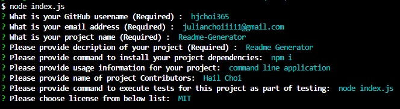

# Professional README Generator

## Purpose of application
When creating an open source project on GitHub, it’s important to have a high-quality README for the app. This should include what the app is for, how to use the app, how to install it, how to report issues, and how to make contributions—this last part increases the likelihood that other developers will contribute to the success of the project.

You can quickly and easily generate a README file by using a command-line application to generate one. This allows the project creator to devote more time working on the project.

[How to create a Professional README](./readme-guide.md)

## Description
 This is a command-line application that dynamically generates a professional README.md file from a user's input using inquirer package.This application is developed using node.js.This command line application accepts following user input and based on user response high-quality, professional README.md will be generated.
 Project title, project description, Table of Contents, Installation, Usage, License, Contributing, Tests, and Questions.
 User can choose from 4 license options (MIT, Apache,GPLv3,Unlicense) and based on user selection a badge for that license is added near the top of the README and a notice is added to the section of the README entitled License that explains which license the application is covered under.
 Questions section have a link to my github profile and email id to reach me with additional questions.

 ## Pre-requisites for project
 * Be sure to include node_modules/ and .DS_Store/ to .gitignore file, so that your node_modules directory isn't tracked or uploaded to GitHub.
 * Make sure project directory includes a package.json with the required dependencies. You can create one by running npm init when you first set up the project, before installing any dependencies.
 * Use command npm i inquirer to install inquirer package.
 * once installation is done, application can be invoked using command : node index.js
 * Readme file will be generated in dist folder, which will be created at the root of the project directory, if it doesn't already exist.

 ## User Story
 AS A developer
 I WANT a README generator
 SO THAT I can quickly create a professional README for a new project 

 ## Acceptance Criteria
 GIVEN a command-line application that accepts user input
WHEN I am prompted for information about my application repository
THEN a high-quality, professional README.md is generated with the title of my project and sections entitled Description, Table of Contents, Installation, Usage, License, Contributing, Tests, and Questions
WHEN I enter my project title
THEN this is displayed as the title of the README
WHEN I enter a description, installation instructions, usage information, contribution guidelines, and test instructions
THEN this information is added to the sections of the README entitled Description, Installation, Usage, Contributing, and Tests
WHEN I choose a license for my application from a list of options
THEN a badge for that license is added near the top of the README and a notice is added to the section of the README entitled License that explains which license the application is covered under
WHEN I enter my GitHub username
THEN this is added to the section of the README entitled Questions, with a link to my GitHub profile
WHEN I enter my email address
THEN this is added to the section of the README entitled Questions, with instructions on how to reach me with additional questions
WHEN I click on the links in the Table of Contents
THEN I am taken to the corresponding section of the README

## Video link

[Application walkthrough video link](./images/Readme-Generator.mp4)

## Mock Image

     

## Built With
* Javascript
* Node js
* Inquirer package
